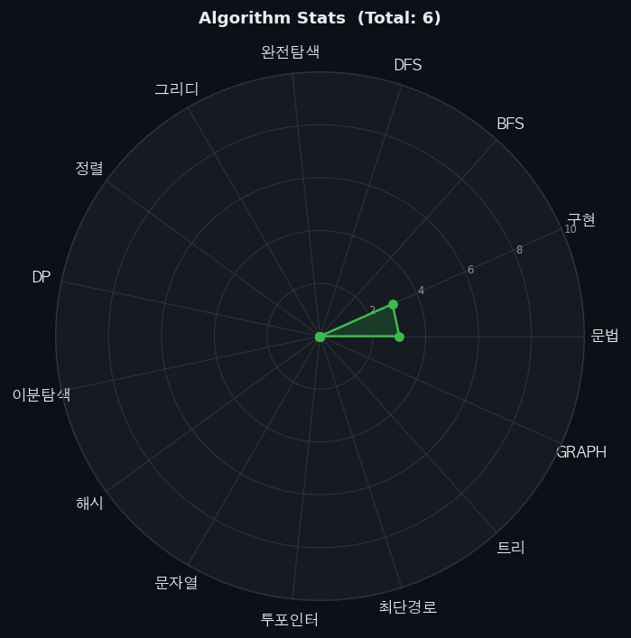

# 이승규의 알고리즘 풀이 기록 🧑‍💻

  

> 문제를 풀 때마다 자동으로 업데이트됩니다.

## 📒 풀이 노션 페이지
👉 [노션에서 상세 풀이 보기](https://www.notion.so/30740ead99a980b4ba86d680b466f398)

## 📊 알고리즘별 현황

| 카테고리 | 풀이 수 |
|---------|:------:|
| 문법 | 14 |
| 구현 | 23 |
| BFS | 0 |
| DFS | 0 |
| 완전탐색 | 0 |
| 그리디 | 0 |
| 정렬 | 3 |
| DP | 0 |
| 이분탐색 | 0 |
| 해시 | 0 |
| 문자열 | 9 |
| 투포인터 | 0 |
| 최단경로 | 0 |
| 트리 | 0 |
| GRAPH | 0 |
